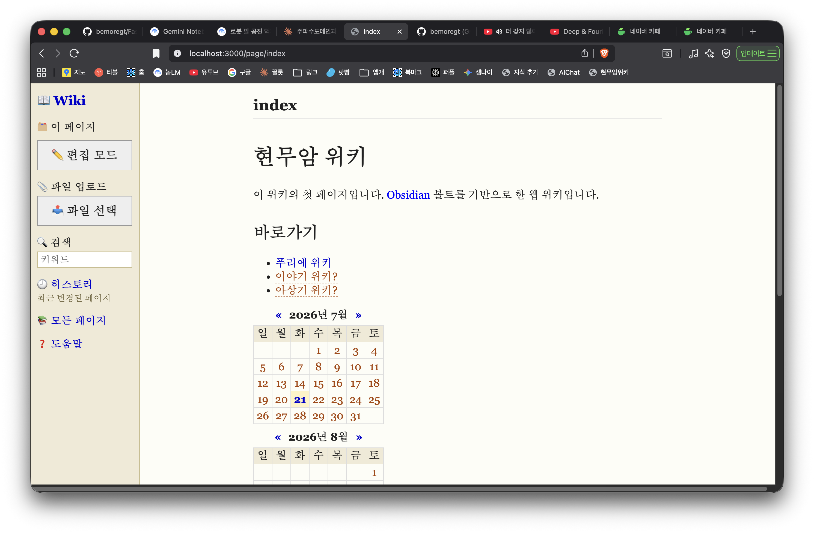

# Obsidian2Swiki (for M1 Mac)

Obsidian 볼트(vault)를 그대로 데이터 저장소로 쓰는, 옛날 Squeak/Swiki 스타일의 가벼운 웹 위키 서버입니다. Node.js + Express로 만들었고, 볼트의 `.md` 파일을 직접 읽고 씁니다 — Obsidian 앱과 계속 호환됩니다.



## 특징

- **단순 태그 문법** (표준 마크다운과는 다른, Squeak wiki 스타일)
  - `*단어*` — 위키 링크. 페이지가 없으면 클릭 시 자동 생성되고 바로 편집 화면으로 이동
  - `!강조!` — 강조(이탤릭)
  - `` `코드` `` 또는 `<code>코드</code>` — 인라인 코드 (파이썬 문법 강조)
  - ` ``` ` 또는 `<code>` ~ `</code>` (각 줄 단독) — 여러 줄 코드 블록 (기본 파이썬, 언어 지정 가능)
  - `# 제목`, `## 제목`, `### 제목` — 제목
  - `- 항목` — 불릿 목록
  - `<calendar>` / `<calendar:2026-07>` — Swiki 스타일 달력. 날짜 클릭 시 `YYYY-MM-DD` 페이지로 이동/생성
  - `` — 업로드한 이미지 표시
  - `[파일명](주소)` — 업로드한 파일 다운로드 링크
  - `"인용문"` — 큰따옴표로 묶인 텍스트는 어두운 적색 볼드체로 자동 강조
- **외국어 단어 강조**: 영어 등 라틴 문자로 된 단어는 파란색으로 자동 표시
- **좌측 사이드바**: 검색, 히스토리(최근 변경), 전체 페이지 목록, 도움말, 파일 업로드, 그리고 현재 페이지의 편집/보기/저장 버튼
- **파일 업로드**: 사이드바에서 파일 선택 시 편집 중인 커서 위치에 자동 삽입. 편집 화면에서 이미지를 복사 붙여넣기(Cmd+V) 해도 바로 업로드/삽입됨
- **읽어주기(TTS)**: 보기 화면 하단 🔊 버튼으로 페이지를 음성으로 읽어줌.
  - 오픈소스 한국어 음성 모델(`facebook/mms-tts-kor`)을 서버에서 직접 구동 — macOS 기본 음성 대신 사용
  - Apple Silicon GPU(MPS) 가속 + 문장 단위 스트리밍 재생으로 첫 문장은 약 1초 내에 재생 시작
  - 동일 문장은 디스크 캐시로 즉시 재생
  - 차분하게 읽도록 톤(피치/속도 변동폭) 튜닝 적용
- **전문용어 페이지 만들기**: 보기 화면 하단 🏷️ 버튼 — 파란색으로 강조된 외국어/전문용어 중 원하는 것을 체크하면, 로컬 Ollama(`gemma4:cloud`) 모델이 짧은 설명을 생성해 새 페이지로 만들고 현재 문서에서 링크로 연결함

## 실행 방법

```bash
npm install
npm start
```

`npm start`는 위키 서버(Node)와 함께 TTS 서버(Python)도 자동으로 함께 띄웁니다. TTS를 처음 쓰려면 먼저 아래처럼 전용 가상환경을 한 번 만들어야 합니다:

```bash
python3 -m venv tts_env
source tts_env/bin/activate
pip install torch transformers scipy uroman
deactivate
```

기본적으로 `~/Documents/Jungok_Stone` 볼트를 사용하고, `http://localhost:3000` 에서 서비스됩니다.

다른 볼트를 쓰려면:

```bash
VAULT_PATH="/path/to/your/vault" PORT=3000 npm start
```

전문용어 페이지 만들기 기능은 [Ollama](https://ollama.com)가 로컬에서 실행 중이어야 하고, 기본값은 `gemma4:cloud` 모델(Ollama 클라우드, 로그인 필요)입니다. 다른 모델을 쓰려면:

```bash
OLLAMA_HOST="http://localhost:11434" OLLAMA_MODEL="다른모델명" npm start
```

## 요구 사항

- Node.js
- Python 3 (TTS 서버용, `tts_env` 가상환경)
- Ollama (전문용어 페이지 자동 생성 기능용, `gemma4:cloud` 등 모델 설치 필요)
- 로컬 Obsidian 볼트 (일반 `.md` 파일 폴더)
