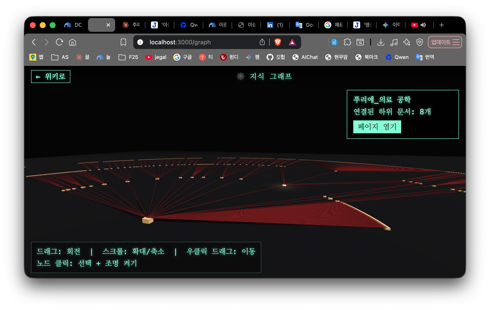

# Obsidian2Swiki (for M1 Mac)

Obsidian 볼트(vault)를 그대로 데이터 저장소로 쓰는, 옛날 Squeak/Swiki 스타일의 가벼운 웹 위키 서버입니다. Node.js + Express로 만들었고, 볼트의 `.md` 파일을 직접 읽고 씁니다 — Obsidian 앱과 계속 호환됩니다.


## 특징

- **단순 태그 문법** (표준 마크다운과는 다른, Squeak wiki 스타일)
  - `*단어*` — 위키 링크. 페이지가 없으면 클릭 시 자동 생성되고 바로 편집 화면으로 이동
  - `!강조!` — 강조(이탤릭)
  - `` `코드` `` 또는 `<code>코드</code>` — 인라인 코드 (파이썬 문법 강조)
  - ` ``` ` 또는 `<code>` ~ `</code>` (각 줄 단독) — 여러 줄 코드 블록 (기본 파이썬, 언어 지정 가능)
  - `# 제목`, `## 제목`, `### 제목` — 제목
  - `- 항목` — 불릿 목록
  - `<calendar>` / `<calendar:2026-07>` — Swiki 스타일 달력. 날짜 클릭 시 `YYYY-MM-DD` 페이지로 이동/생성
  - `` — 업로드한 이미지 표시
  - `[파일명](주소)` — 업로드한 파일 다운로드 링크
  - `"인용문"` — 큰따옴표로 묶인 텍스트는 어두운 적색 볼드체로 자동 강조
- **외국어 단어 강조**: 영어 등 라틴 문자로 된 단어는 초록색으로 자동 표시. 위키 링크(`*단어*`)로 실제 페이지에 연결된 단어는 파란색 밑줄로 표시되어 클릭 가능함을 구분함
- **좌측 사이드바**: 검색, 히스토리(최근 변경), 전체 페이지 목록, 도움말, 파일 업로드, 그리고 현재 페이지의 편집/보기/저장 버튼
- **파일 업로드**: 사이드바에서 파일 선택 시 편집 중인 커서 위치에 자동 삽입. 편집 화면에서 이미지를 복사 붙여넣기(Cmd+V) 해도 바로 업로드/삽입됨
- **텍스트 복사**: 보기 화면 하단 📋 버튼 — 본문 전체 텍스트를 클립보드로 복사
- **전문용어 페이지 만들기**: 보기 화면 하단 🏷️ 버튼 — 초록색으로 강조된 외국어/전문용어 중 원하는 것을 체크하면, 로컬 Ollama(`gemma4:cloud`) 모델이 짧은 설명을 생성해 새 페이지로 만들고 현재 문서에서 링크로 연결함
- **유튜브 영상 만들기**: 보기 화면 하단 🎬 버튼 — 문서에 업로드된 오디오 파일과 PDF 파일이 함께 링크되어 있으면, PDF의 각 페이지를 이미지로 변환해 오디오 길이에 맞춰 균등하게 배분한 슬라이드쇼(1920x1080 mp4)를 만들고, 로컬 Ollama(`gemma4:cloud`)가 문서 내용을 바탕으로 유튜브용 제목/설명을 생성해 영상과 함께 문서 하단에 자동 삽입
- **쇼츠 영상 만들기**: 🎬 버튼 옆 📱 버튼 — 같은 오디오+PDF 소스를 처음 3분만 잘라, 세로(1080x1920) 검은 배경 영상으로 만들어 문서 하단에 자동 삽입
- **핵심 함수 만들기**: 보기 화면 하단 🧩 버튼 — 문서가 설명하는 알고리즘/개념을 로컬 Ollama(`gemma4:cloud`)가 실제로 동작하는 파이썬 함수 정확히 3개로 나눠 구현(뼈대나 `pass`가 아니라 설명된 내용을 전부 구현)하고, 각 함수 코드 밑에 한 줄 설명을 붙임. 이어서 전체 알고리즘의 실행 순서를 Mermaid 플로우차트로 그리고 그 3개 함수가 호출되는 단계를 색으로 강조 표시함 (mermaid.js는 로컬에 내장되어 완전히 오프라인으로 렌더링)
- **3D 지식 그래프**: 사이드바 🕸️ 지식 그래프 — 위키의 `*링크*` 연결을 트리 구조로 단순화해 Three.js(WebGL)로 그린 3D 네비게이터 (영화 쥐라기공원의 유닉스 파일 네비게이터 느낌). `index` 페이지(없으면 가장 많이 연결된 페이지)를 가까이 두고, 링크가 깊어질수록 멀리·작게 배치해 원근감을 줌. 각 페이지는 누런 종이박스색의 납작한 직육면체로, 부모-자식 연결은 두께를 가진 암적색 파이프로 표시되고 그림자가 드리워져 입체적으로 보임. 드래그로 회전, 스크롤로 확대/축소, 우클릭 드래그로 이동, 박스 클릭 시 조명이 켜지며 해당 페이지로 이동하는 버튼이 뜸 (three.js는 로컬에 내장되어 오프라인 동작)

  

## 실행 방법

```bash
npm install
npm start
```

기본적으로 `~/Documents/Jungok_Stone` 볼트를 사용하고, `http://localhost:3000` 에서 서비스됩니다.

다른 볼트를 쓰려면:

```bash
VAULT_PATH="/path/to/your/vault" PORT=3000 npm start
```

전문용어 페이지 만들기 / 유튜브·쇼츠 제목·설명 생성 / 핵심 함수·흐름도 만들기 기능은 모두 [Ollama](https://ollama.com)가 로컬에서 실행 중이어야 하고, 기본값은 `gemma4:cloud` 모델(Ollama 클라우드, 로그인 필요)입니다. 다른 모델을 쓰려면:

```bash
OLLAMA_HOST="http://localhost:11434" OLLAMA_MODEL="다른모델명" npm start
```

## 요구 사항

- Node.js
- Ollama (전문용어 페이지/유튜브·쇼츠 제목·설명/핵심 함수·흐름도 자동 생성 기능용, `gemma4:cloud` 등 모델 설치 필요)
- `ffmpeg`, `poppler-utils`(`pdftoppm`, `pdftotext`) — 유튜브/쇼츠 영상 생성 기능용 (Ubuntu: `sudo apt install ffmpeg poppler-utils`, macOS: `brew install ffmpeg poppler`)
- 로컬 Obsidian 볼트 (일반 `.md` 파일 폴더)
