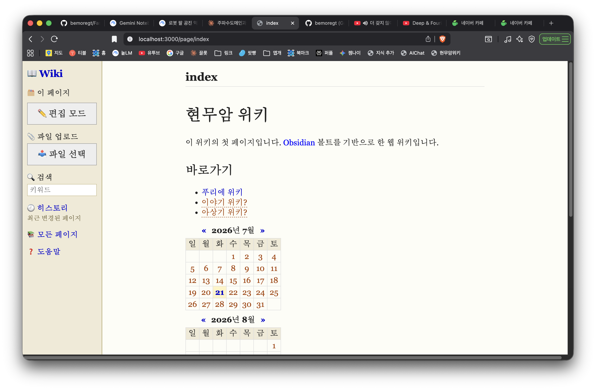
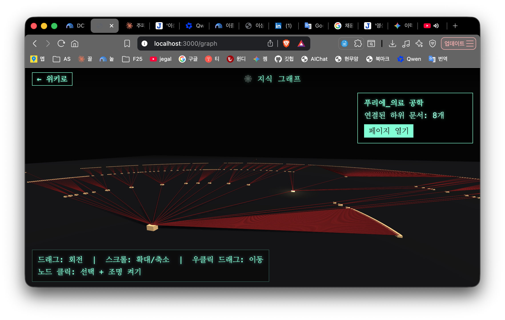

# Obsidian2Swiki (for M1 Mac)

Obsidian 볼트(vault)를 그대로 데이터 저장소로 쓰는, 옛날 Squeak/Swiki 스타일의 가벼운 웹 위키 서버입니다. Node.js + Express로 만들었고, 볼트의 `.md` 파일을 직접 읽고 씁니다 — Obsidian 앱과 계속 호환됩니다.



## 특징

- **단순 태그 문법** (표준 마크다운과는 다른, Squeak wiki 스타일)
  - `*단어*` — 위키 링크. 페이지가 없으면 클릭 시 자동 생성되고 바로 편집 화면으로 이동
  - `!강조!` — 강조(이탤릭)
  - `` `코드` `` 또는 `<code>코드</code>` — 인라인 코드 (파이썬 문법 강조)
  - ` ``` ` 또는 `<code>` ~ `</code>` (각 줄 단독) — 여러 줄 코드 블록 (기본 파이썬, 언어 지정 가능)
  - `# 제목`, `## 제목`, `### 제목` — 제목
  - `- 항목` — 불릿 목록
  - `__` (줄 맨 앞, 단독) — 구분선(수평선)
  - `<calendar>` / `<calendar:2026-07>` — Swiki 스타일 달력. 날짜 클릭 시 `YYYY-MM-DD` 페이지로 이동/생성
  - `` — 업로드한 이미지 표시
  - `[파일명](주소)` — 업로드한 파일 다운로드 링크
  - `"인용문"` — 큰따옴표로 묶인 텍스트는 어두운 적색 볼드체로 자동 강조
- **외국어 단어 강조**: 영어 등 라틴 문자로 된 단어는 초록색으로 자동 표시. 위키 링크(`*단어*`)로 실제 페이지에 연결된 단어는 파란색 밑줄로 표시되어 클릭 가능함을 구분함
- **좌측 사이드바**: 검색, 히스토리(최근 변경), 전체 페이지 목록, 도움말, 파일 업로드, 그리고 현재 페이지의 편집/보기/저장 버튼
- **파일 업로드**: 사이드바에서 파일 선택 시 편집 중인 커서 위치에 자동 삽입. 편집 화면에서 이미지를 복사 붙여넣기(Cmd+V) 해도 바로 업로드/삽입됨
- **텍스트 복사**: 보기 화면 하단 📋 버튼 — 본문 전체 텍스트를 클립보드로 복사
- **키워드로 채용정보 찾기**: 보기 화면 하단 💼 **최근 1개월**/**최근 1주일** 버튼 — 문서 제목을 키워드로 사람인·잡코리아·원티드·LinkedIn 검색결과로 바로 가는 링크 4개를 문서 맨 아래에 추가함. AI가 채용공고를 지어내지 않도록 실제 사이트 검색 링크만 생성함(LinkedIn은 선택한 기간의 필터가 자동 적용되고, 나머지는 사이트에서 직접 필터 적용 필요)
- **키워드로 RSS Feed 찾기**: 보기 화면 하단 📡 버튼 — 문서 제목을 키워드로 Google 뉴스·Bing 뉴스·Reddit의 실제 작동하는 RSS 검색 주소 3개를 문서 맨 아래에 추가함. 채용정보 찾기와 같은 이유로 AI가 피드 주소를 지어내지 않고, 키워드로 직접 검색되는 진짜 RSS 엔드포인트만 나열함. 각 링크를 클릭하면 원본 XML이 아니라, 서버가 `rss-parser`로 피드를 직접 읽어와 기사 제목·날짜·요약을 보기 좋은 목록으로 렌더링한 페이지(`/rss-view`)가 열리고, 그 위에 원본 RSS 주소도 함께 표시되어 피드 리더 구독용으로 복사할 수 있음. 이 페이지 하단의 🇰🇷 **한글로 번역하기** 버튼을 누르면 로컬 Ollama(`gemma4:cloud`)가 각 기사의 제목·요약(최대 30개)을 한 번에 번역해서 항목마다 원문 바로 아래에 번역문을 추가로 보여줌 (페이지 새로고침 없이 그 자리에서 나타남)
- **영상 제목·설명 번역**: 보기 화면 하단 🌐 버튼 — 🎬 유튜브 영상 만들기로 생성된 "- 제목: ..."과 "- 설명: ..." 줄만 찾아 로컬 Ollama(`gemma4:cloud`) 모델로 각각 영어로 번역해 문서 맨 아래에 새 섹션으로 추가함 (문서 전체가 아니라 영상 제목·설명 텍스트만 번역, 원문은 그대로 유지)
- **키워드로 최신 arXiv 논문 찾기**: 보기 화면 하단 📚 **최근 1개월**/**최근 1주일** 버튼 — 문서 제목을 키워드로 [arXiv의 공식 검색 API](https://arxiv.org/help/api)에서 그 기간 내 새로 올라온 논문(최대 5개, 제출일 최신순)을 실제로 조회함. AI가 논문을 지어내지 않도록 진짜 arXiv 메타데이터(제목·저자·초록 링크)만 사용하고, 찾은 논문의 PDF는 자동으로 다운로드해 이 문서에 업로드·링크까지 함께 처리함(다운로드 실패한 논문은 초록 페이지 링크만 남음). 여러 단어로 된 제목은 정확한 문구로 검색해 관련 없는 논문이 섞이는 것을 줄임
- **첨부 PDF 논문 요약**: 보기 화면 하단 📄 버튼 — 문서에 링크된 PDF 파일(위 arXiv 검색으로 받은 논문이든 직접 업로드한 논문이든)에서 `pdftotext`로 텍스트를 추출한 뒤, 로컬 Ollama(`gemma4:cloud`)가 "핵심 기여 / 방법론 / 실험 결과" 세 항목으로 구조화한 한국어 요약을 만들어 문서 맨 아래에 추가함
- **수식(LaTeX) 렌더링**: `$수식$`(인라인) / `$$수식$$`(블록, 가운데 정렬) 문법을 지원. KaTeX가 로컬에 내장되어 완전히 오프라인으로 렌더링되며, `$100` 같은 일반 금액 표기와 혼동되지 않도록 두 `$` 사이 내용의 앞뒤에 공백이 없을 때만 수식으로 인식함 (각 수식은 한 줄 안에 작성해야 함)
- **관련 문서 추천**: 보기 화면 하단 🔗 버튼 — 위키의 `*링크*` 그래프(3D 지식 그래프와 같은 데이터)에서 현재 문서와 2단계 이내로 연결된 다른 페이지를 실제로 찾아 가까운 순서로 나열하고, 로컬 Ollama(`gemma4:cloud`)가 두 문서가 왜 관련 있는지 한 줄씩 설명을 붙여 문서 맨 아래에 추가함. 추천 후보는 항상 실제로 연결된 진짜 페이지이고, AI는 그 이유만 설명함(페이지 자체를 지어내지 않음)
- **유튜브 영상 분석·요약**: 보기 화면 하단 🎥 버튼 — 문서 안에서 유튜브 링크를 찾아(일반 텍스트든 `*링크*`든 `[라벨](링크)`든 어떤 형태로 적혀 있어도 인식함) 그 영상의 자막(자동 생성 자막 포함)을 실제로 가져온 뒤, 로컬 Ollama(`gemma4:cloud`)가 그 자막 텍스트만 보고 요약과 핵심 포인트 3~5개를 한국어로 작성해 문서 맨 아래에 추가함. LLM은 영상을 직접 보거나 들을 수 없으므로 반드시 자막이 있어야 동작하며, 자막이 없는 영상은 요약하지 않고 오류 메시지를 표시함 (영상 제목/작성자는 YouTube의 oEmbed로 가져옴, API 키 불필요)
- **코드로 테스트하기**: 보기 화면 하단 🧪 버튼 — 문서 내용을 보고 AI가 이 알고리즘이 이미지·오디오·비디오 중 무엇을 다루는지부터 판단해서, 로컬 Ollama(`gemma4:cloud`)가 그에 맞는 `process_image(input_path, output_path, ...)`(PIL/numpy/OpenCV/scipy), `process_audio(input_path, output_path, ...)`(numpy/scipy/matplotlib), 또는 `process_video(input_path, output_path, ...)`(OpenCV `VideoCapture`/`VideoWriter`로 프레임 단위 처리) 파이썬 함수를 구현함. 문서에 첨부된, 그 판단에 맞는 파일(이미지·오디오·비디오 - 오디오는 업로드 형식과 무관하게 서버가 먼저 WAV로 변환해 넘김)을 실제 입력으로 그 코드를 서버에서 직접 실행함. 결과도 알고리즘 성격에 맞춰 AI가 정함 — 스펙트로그램/위상 그래프나 비디오 전체를 요약한 대표 프레임처럼 눈으로 한 번만 봐도 되는 결과는 이미지로, 필터링·노이즈 제거된 소리 자체가 결과면 오디오 파일로, 모션 검출·트래킹처럼 매 프레임의 결과를 봐야 하면 비디오 파일로 저장하고, 코드와 함께 문서 맨 아래에 추가함(오디오/비디오 결과는 기존 첨부와 동일하게 재생 플레이어로 표시됨). 비디오는 프레임 단위 처리라 이미지·오디오보다 오래 걸릴 수 있어 실행 제한이 3분(다른 두 모달리티는 60초)이고, 생성된 코드가 어떤 코덱으로 저장하든 서버가 재생 호환을 위해 항상 H.264 mp4로 다시 인코딩함. 알고리즘에 임계값·커널 크기·필터 종류 같은 조절 가능한 핵심 파라미터가 있으면 AI가 자동으로 슬라이더/드롭다운 컨트롤로 만들어 화면에 노출하고, 값을 바꾸면 같은 코드를 새 값으로 즉시 다시 실행해 결과가 새로고침 없이 바로 갱신됨(이미지·오디오·비디오 결과 모두 동일). 이 파라미터 구성은 저장된 코드 첫 줄의 주석(`# CODETEST_PARAMS: ...`)에 함께 담겨 문서에 영구 저장되므로, 나중에 이 페이지를 다시 열어도(브라우저를 새로고침해도) 슬라이더/드롭다운이 그대로 다시 나타나 계속 조절할 수 있음 — 다만 문서에 실제로 저장되는 결과는 버튼을 눌렀을 때의 기본값 결과 한 개뿐이고, 슬라이더로 만든 미리보기들은 파일로 남지 않음. ⚠️ 이 기능은 AI가 생성한 코드를 실제로 로컬에서 실행합니다 — 완전한 샌드박스는 아니며(진짜 격리 환경이 아님), `os.system`/`subprocess`/`eval`/`exec`/네트워크 요청/파일 삭제 등 위험해 보이는 구문이 포함된 코드는 (파라미터 조절로 인한 재실행 포함 매번) 차단하고 실행 시간 제한을 두지만, 이 방어는 우회 가능성이 있는 최선의 노력 수준입니다. 신뢰하는 개인 환경에서만 사용하세요.
- **이력서 최적화하기**: 보기 화면 하단 📝 버튼 — 문서에 첨부된 이력서(.docx)를 pandoc으로 마크다운 텍스트로 추출한 뒤, 문서 본문(지원하려는 회사/채용 공고 정보)에 맞춰 로컬 Ollama(`gemma4:cloud`)가 내용을 다듬음. 이력서에 없는 경력·학력·자격을 새로 지어내지 않고, 실제로 있는 내용 중 채용 공고와 관련 있는 부분을 강조하고 표현을 다듬는 정도로만 수정하도록 프롬프트로 제한함. 다듬어진 마크다운은 다시 pandoc으로 진짜 .docx 파일로 변환해 문서에 첨부하고, 무엇을 왜 바꿨는지 변경사항 목록도 함께 추가함. 첨부된 .docx가 없으면 오류 메시지를 표시함
- **주피터 노트북으로 변경**: 보기 화면 하단 📓 버튼 — 문서 안 ` ```python ` 코드 블록(없으면 첨부된 .py 파일)을 셀 단위로 나눠 페이지 위에 실제 주피터 노트북처럼(`In [n]:`/`Out[n]:` 프롬프트, 문법 강조된 코드) 렌더링하고, **각 셀마다 개별 "▶ 실행" 버튼**으로 한 셀씩 순서대로 실행할 수 있게 함. 셀의 코드는 읽기 전용이 아니라 **바로 편집 가능**함(textarea) - 실행 버튼은 편집된 현재 내용을 그대로 실행하고, 그 편집 결과가 그 셀의 새 내용으로 남음(문서 본문의 원본 ```python 블록 자체는 건드리지 않고, 세션에서만 유지 - 상단 버튼으로 다시 시작하면 원본으로 되돌아감)(다운로드용 .ipynb 링크도 함께 제공). `nbformat`/`jupyter` 패키지 없이 nbformat 4.5 JSON을 직접 만들며, 페이지마다 진짜 지속되는 파이썬 프로세스("커널", `lib/kernel.js` + `lib/kernel_worker.py`)를 띄워서 — 서로 다른 버튼 클릭(별개의 HTTP 요청)에 걸쳐서도 앞 셀에서 만든 변수·임포트를 뒤 셀에서 그대로 이어 쓸 수 있음(진짜 주피터 커널의 전역 스코프와 동일). 어떤 셀이 오류가 나도 다른 셀은 독립적으로 계속 실행 가능(실제 주피터처럼 "전체 중단"이 아님). 코드에 `# 1. ...`, `# 2. ...`처럼 번호 붙은 주석이 있으면 그 경계로 셀을 나누고, 없으면 빈 줄 2개 이상을 기준으로 나눔. 상단 버튼을 누르면 커널을 새로 띄우고 모든 셀을 미실행(`In [ ]:`) 상태로 초기화함. 셀을 실행할 때마다 같은 .ipynb 파일과 같은 문서 섹션을 덮어써 항상 현재 진행 상태를 반영함(중복 누적 없음). 코드테스트 기능과 같은 안전장치(`os.system`/`subprocess`/`eval`/`exec`/네트워크 요청/파일 삭제 등 차단)를 셀마다 적용하고, 한 셀이 3분을 넘기면 그 셀을 중단하고 커널을 초기화함. 커널은 15분 동안 아무 실행 요청이 없으면 자동 종료됨(다음 실행 시 자동으로 새로 시작 - 이 경우 이전 셀들의 상태는 사라지므로 처음부터 다시 실행해야 함)
- **전문용어 페이지 만들기**: 보기 화면 하단 🏷️ 버튼 — 초록색으로 강조된 외국어/전문용어 중 원하는 것을 체크하면, 로컬 Ollama(`gemma4:cloud`) 모델이 짧은 설명을 생성해 새 페이지로 만들고 현재 문서에서 링크로 연결함
- **유튜브 영상 만들기**: 보기 화면 하단 🎬 버튼 — 문서에 업로드된 오디오 파일과 PDF 파일이 함께 링크되어 있으면, PDF의 각 페이지를 이미지로 변환해 오디오 길이에 맞춰 균등하게 배분한 슬라이드쇼(1920x1080 mp4)를 만들고, 로컬 Ollama(`gemma4:cloud`)가 문서 내용을 바탕으로 유튜브용 제목/설명을 생성해 영상과 함께 문서 하단에 자동 삽입
- **쇼츠 영상 만들기**: 🎬 버튼 옆 📱 버튼 — 같은 오디오+PDF 소스를 처음 3분만 잘라, 세로(1080x1920) 검은 배경 영상으로 만들어 문서 하단에 자동 삽입
- **핵심 함수 만들기**: 보기 화면 하단 🧩 버튼 — 문서가 설명하는 알고리즘/개념을 로컬 Ollama(`gemma4:cloud`)가 실제로 동작하는 파이썬 함수 정확히 3개로 나눠 구현(뼈대나 `pass`가 아니라 설명된 내용을 전부 구현)하고, 각 함수 코드 밑에 한 줄 설명을 붙임. 이어서 전체 알고리즘의 실행 순서를 Mermaid 플로우차트로 그리고 그 3개 함수가 호출되는 단계를 색으로 강조 표시함 (mermaid.js는 로컬에 내장되어 완전히 오프라인으로 렌더링)
- **3D 지식 그래프**: 사이드바 🕸️ 지식 그래프 — 위키의 `*링크*` 연결을 트리 구조로 단순화해 Three.js(WebGL)로 그린 3D 네비게이터 (영화 쥐라기공원의 유닉스 파일 네비게이터 느낌). `index` 페이지(없으면 가장 많이 연결된 페이지)를 가까이 두고, 링크가 깊어질수록 멀리·작게 배치해 원근감을 줌. 각 페이지는 하늘색 납작한 직육면체로, 그 지붕 위에 페이지 제목이 간판처럼 표시됨(한글 포함, 캔버스 텍스처로 렌더링). 부모-자식 연결은 바닥에 깔린 카키색 띠로 표시되고 그림자가 드리워져 입체적으로 보임. 바닥은 어두운 분홍색 불투명 단색 평면(격자선 없음), 배경은 지평선 부근이 밝은 초록으로 빛나고 위·아래로 갈수록 검정으로 어두워지는 그러데이션. 드래그로 회전, 스크롤로 확대/축소, 우클릭 드래그로 이동, 박스나 그 박스로 이어지는 링크 띠를 클릭하면(링크를 클릭하면 클릭한 지점에서 더 가까운 쪽 끝 노드가 선택됨 — 하위쪽뿐 아니라 상위쪽으로도 이동 가능) 연노란색 스포트라이트(경계가 또렷하고 훨씬 좁게 좁힌 원형 조명 + 반투명한 빛줄기가 각광처럼 그 지점만 비춤)가 켜지며 그 노드에서 뻗어나가는 링크 방향을 낮은 고도에서 가까이 바라보도록 카메라가 천천히 줌인하고, 패널에서 해당 페이지로 이동하는 버튼이 뜸. 링크의 상위(부모) 쪽을 클릭하면 온 방향을 돌아보는 시점으로 전환됨. **B** 키(또는 패널의 **◀ 이전** 버튼)는 실제 탐색 이력을 거슬러 이전 노드로, **↓(아래 화살표)** 키(또는 패널의 **▲ 상위** 버튼)는 현재 노드의 트리 상위 노드로 바로 이동 — 브라우저 확장 프로그램이 키를 가로챌 수 있어 버튼도 함께 제공 (three.js는 로컬에 내장되어 오프라인 동작)

  

## 실행 방법

```bash
npm install
npm start
```

기본적으로 `~/Documents/Jungok_Stone` 볼트를 사용하고, `http://localhost:3000` 에서 서비스됩니다.

다른 볼트를 쓰려면:

```bash
VAULT_PATH="/path/to/your/vault" PORT=3000 npm start
```

전문용어 페이지 만들기 / 유튜브·쇼츠 제목·설명 생성 / 핵심 함수·흐름도 만들기 기능은 모두 [Ollama](https://ollama.com)가 로컬에서 실행 중이어야 하고, 기본값은 `gemma4:cloud` 모델(Ollama 클라우드, 로그인 필요)입니다. 다른 모델을 쓰려면:

```bash
OLLAMA_HOST="http://localhost:11434" OLLAMA_MODEL="다른모델명" npm start
```

## 요구 사항

- Node.js
- Ollama (전문용어 페이지/유튜브·쇼츠 제목·설명/핵심 함수·흐름도 자동 생성 기능용, `gemma4:cloud` 등 모델 설치 필요)
- `ffmpeg`, `poppler-utils`(`pdftoppm`, `pdftotext`) — 유튜브/쇼츠 영상 생성 및 첨부 PDF 논문 요약 기능용 (Ubuntu: `sudo apt install ffmpeg poppler-utils`, macOS: `brew install ffmpeg poppler`)
- 로컬 Obsidian 볼트 (일반 `.md` 파일 폴더)
